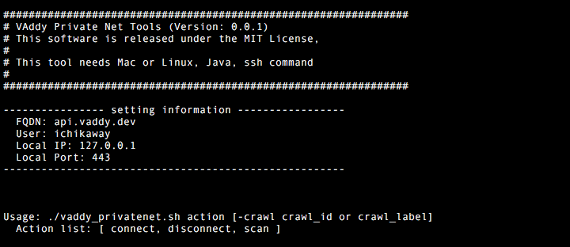
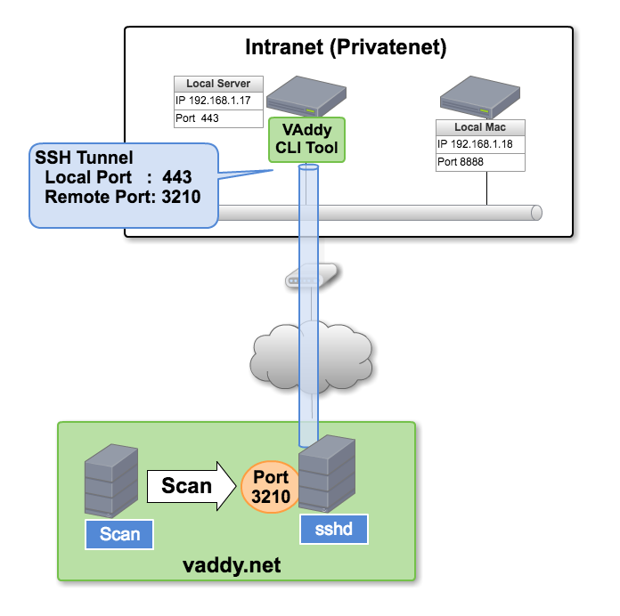

VAddy for Private Net CLI tool
======================================

VAddy for Private Net コマンド  
[https://vaddy.net](https://vaddy.net)

イントラネット内のサーバや、ローカルPC、VMなどの環境にもVAddyの脆弱性検査が実施できるツールです。

## 動作説明

このツールは、sshのリモートポートフォワードを使ったsshトンネルを作ります。
ローカルのWebサーバのポートが、sshトンネルによりVAddyのサーバ側に公開されますので、VAddyはそこを通して検査します。  
ローカルのWebサーバのポートが外部に公開される形ですが、その公開されたポートへはVAddyサーバのみアクセスできるように制限されていますのでご安心ください。  

この図の例では、あなた専用に割り当てたVAddy sshdのリモートポート 3210と、ローカルポート443をVAddy CLI Toolを使って結びます。VAddyの検査リクエストは、このポート3210を通して行います。  
3210のようなリモートポート番号は、ユーザのFQDN毎に自動的に割り当てられ、VAddy CLI Toolが自動的にsshトンネルを作成するようにできています。

## 動作環境

このツールでは、javaとssh, ssh-keygen, psコマンドを利用します。  
そのため、現在ではMacとLinuxのみサポートとしています。  
本ツールを動かすマシンから外部サーバ(pfd.vaddy.net)へ、SSHアクセスできる環境が必要です（アウトバウンド通信）。

## ダウンロード

[https://github.com/vaddy/go-vaddy/releases](https://github.com/vaddy/go-vaddy/releases)
からzipファイルをダウンロードするか、
git cloneしてご利用ください。

    git clone https://github.com/vaddy/go-vaddy.git

## 設定方法

VAddyのWeb画面からWebAPIキーを発行してください。  
[https://console.vaddy.net/user/webapi](https://console.vaddy.net/user/webapi)  

次に、`privatenet/conf/vaddy.conf.example` ファイルを`privatenet/conf/vaddy.conf`にコピーして、設定情報を書き込みます。
このvaddy.confでは、検査に必要な値を環境変数にセットしています。OS側やCircleCI, TravisCIなどのようなCI側でセットした環境変数は、このconfファイルでセットする必要はありませんので、不要な行はコメントアウトしてください。

### vaddy.conf

| 環境変数                　|  説明                                                     |
| ------------------------|:--------------------------------------------------------|
| VADDY_AUTH_KEY       　　 | VAddyの画面で発行したWebAPIキー                             |
| VADDY_FQDN       　　　   | VAddyで登録したサーバ名(FQDN) 例: www.example.com          |
| VADDY_VERIFICATION_CODE  | VAddyでサーバ登録した際に発行されるVerification Code。       |
| VADDY_USER               | VAddyにログインする際に利用するユーザ名                       |
| VADDY_YOUR_LOCAL_IP      | 検査対象のIP。 localhostや、イントラネットのサーバのIP (例：172.16.1.10) |
| VADDY_YOUR_LOCAL_PORT    | 検査対象のポート。 80, 443など。                            |
| VADDY_CRAWL              | オプション項目。クロールIDやクロールラベルの文字を指定すると、そのクロールが利用される |
| VADDY_HTTPS_PROXY        | オプション項目。VAddyのWebAPIサーバと通信する際にユーザのローカルProxyを通す際の設定。  例: 127.0.0.1:8443 のようにIP:Portをセット。 |

VADDY_YOUR_LOCAL_PORTは1つのポートしか指定できません。  
したがって、検査対象のアプリケーションはHTTPもしくはHTTPSのどちらかになります。`VADDY_YOUR_LOCAL_PORT`で指定するポート番号で、HTTPかHTTPSかを決められます。

## コマンドの終了ステータス

エラーや脆弱性が発見されなかった場合は終了コード 0を返します。これは一般的なコマンドの正常終了と同じ終了コードです。
エラーや脆弱性があった場合は、終了コード1を返します。

## 使い方

### 引数

    Usage: ./vaddy_privatenet.sh action [-crawl crawl_id or crawl_label]   

| action        |                                                           |
| ------------- |:---------------------------------------------------------:|
| connect       | VAddyサーバとsshトンネルを張ります                                       |
| disconnect    | sshトンネルを切断します                                                 |
| scan          | VAddyサーバとsshトンネルを張り、検査を実行します。検査後はトンネルを切断します。 |

connectは、sshトンネルをバックグラウンドで作成した後に、VAddyサーバ経由でのコネクションチェックなど経て、問題なければ正常終了してプロンプトに戻ります。  
例えば、psコマンドでsshプロセスを見れば動作しているか確認できます。  
`ps aux | grep 'ssh -i vaddy/ssh/'`

#### 例1 (connect)

    ./vaddy_privatenet.sh connect

#### 例2 (検査開始)
scanアクションでは、検査実行前に自動的にsshトンネルを作成します。検査後は自動的にトンネルを切断します。

     ./vaddy_privatenet.sh scan

#### 例3 (クロールID 1234を指定した検査)
     ./vaddy_privatenet.sh scan -crawl 1234

オプション`crawl`は必須ではありません。これを指定しない場合は最新のクロールIDのデータを使って脆弱性検査します。
